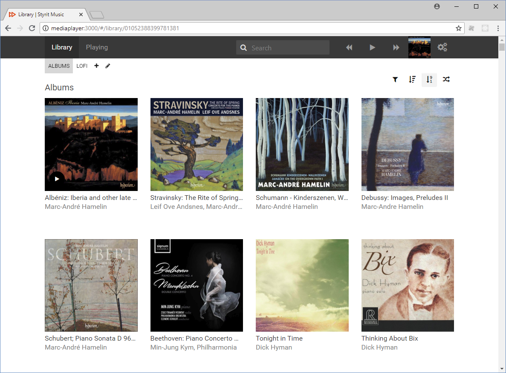
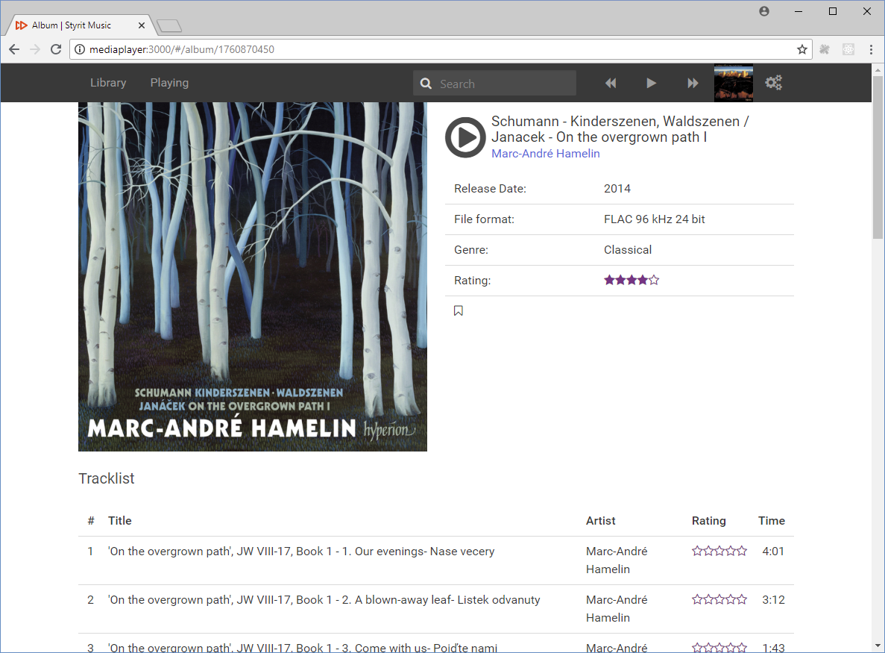
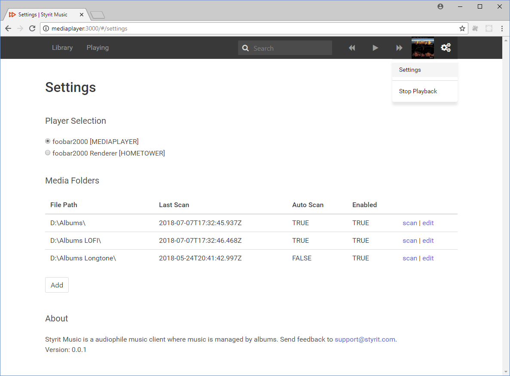

**Styrit Music** is a music controller where you can set up your library and play audio files to a UPnP renderer. Music is managed by albums.

### Notes
 - Download: <https://github.com/Styrit/Music/releases>
 - Help: <https://github.com/Styrit/Music/wiki>
 - This repository is for releases and bug tracking only

### Works with
 - [JPLAY](http://jplay.eu/download/)
 - [JRIver](https://jriver.com/download.html)
 - [Foobar2000](https://www.foobar2000.org/download) + [UPnP plugin](https://www.foobar2000.org/components/view/foo_upnp)
 - Windows 10 (x64)
 

### Key features
 - Control the music from any device with a browser
 - Optimized for speed. 50.000 or 2 Terabytes of files is just fine.
 

### Overview

